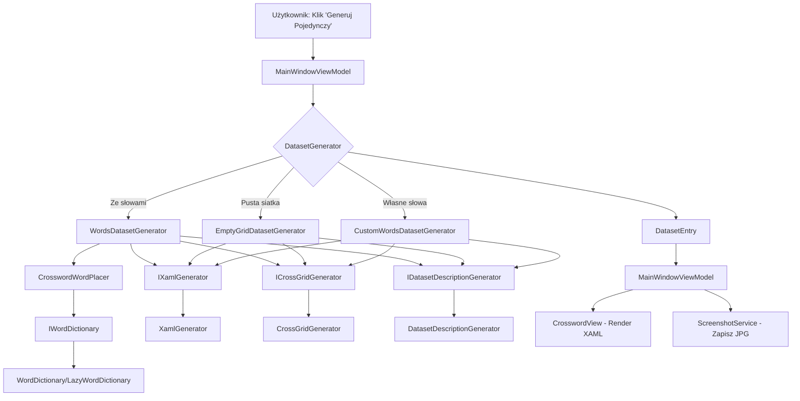
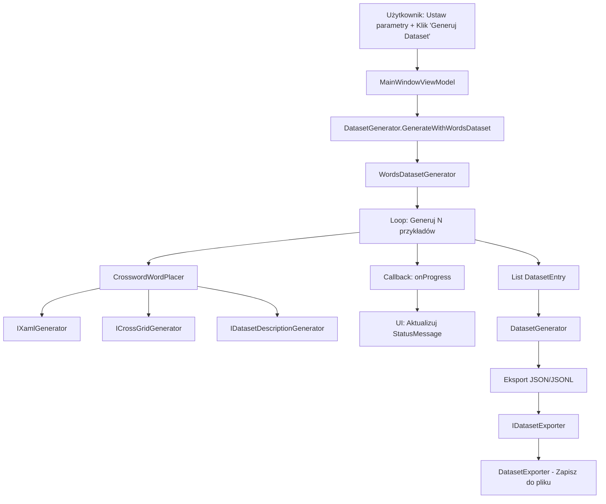
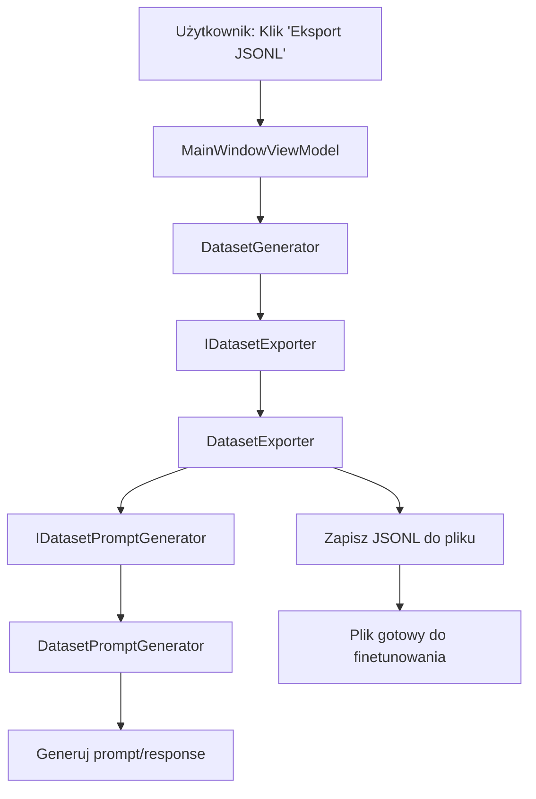

# Crossword AI Generator

[](https://dotnet.microsoft.com/)
[](https://docs.microsoft.com/en-us/dotnet/desktop/wpf/)
[](LICENSE)
[](https://github.com/Maggio333/CrosswordAIGenerator/actions)

**Generator datasetów krzyżówek dla treningu AI (LoRA finetuning i RAG)**

System do deterministycznego generowania krzyżówek z XAML, przeznaczony do tworzenia wysokiej jakości datasetów dla finetunowania modeli językowych (Bielik 4B) oraz dla RAG (Retrieval Augmented Generation).

## 🚀 Szybki start

### Krok 1: Sklonuj i zbuduj

```bash
git clone <repository-url>
cd CrosswordAIGenerator
dotnet restore
dotnet build
```

### Krok 2: Uruchom aplikację

```bash
cd CrosswordAIGenerator.WPF
dotnet run
```

**Gotowe!** Słownik `dictionaries/slowa.txt` jest już w repozytorium, więc aplikacja uruchomi się od razu.

### Krok 3: Wygeneruj pierwszą krzyżówkę

1. **Zaznacz "Ze słowami"** (domyślnie włączone)
2. **Opcjonalnie:** Wprowadź "Hasło główne" (np. "KOT") - jeśli puste, system wybierze losowe
3. **Kliknij "Generuj Pojedynczy"**
4. Zobacz wygenerowaną krzyżówkę w oknie!

### Krok 4: Wygeneruj dataset

1. Ustaw **liczbę przykładów** (np. 100)
2. **Opcjonalnie:** Wprowadź "Hasło główne" (wszystkie krzyżówki będą miały to samo hasło)
3. **Kliknij "Generuj Dataset"**
4. Postęp jest wyświetlany w czasie rzeczywistym
5. Po zakończeniu możesz:
   - **Eksport JSON** - pełny dataset z wszystkimi polami
   - **Eksport JSONL (Finetune)** - format gotowy do finetunowania

### 💡 Wskazówki

- **Hasło główne:** Jeśli podasz hasło, liczba słów = długość hasła (każda litera = jedno słowo)
- **Bez hasła:** System wybierze losowe hasła dla każdej krzyżówki
- **Własne słowa:** Użyj zakładki "Własne słowa" aby stworzyć krzyżówkę z własnymi słowami i definicjami
- **CrossGrid Preview:** Menu "Narzędzia" → "Podgląd CrossGrid" - podgląd i walidacja formatu CrossGrid

---

## 🎯 Cel projektu

Stworzenie nieograniczonego datasetu krzyżówek poprzez:
- **Deterministyczne generowanie** - kod WPF generuje idealne krzyżówki
- **XAML jako DSL** - format łatwy do generowania przez LLM
- **Dataset dla AI** - pary (prompt → XAML) dla finetunowania
- **RAG-ready** - format gotowy do eksportu do Qdrant

## ✨ Funkcjonalności

### ✅ Zaimplementowane (MVP 1)

- **Generowanie pustych siatek** - siatki krzyżówek z opcjonalnymi ścianami
- **Generowanie krzyżówek ze słowami** - automatyczne układanie słów z przecięciami
- **Wyróżnianie hasła głównego** - czerwone tło z numerowanymi literami
- **Własne słowa i definicje** - zakładka do generowania krzyżówek z własnymi słowami i definicjami
- **Puste wersje krzyżówek** - automatyczne generowanie pustych wersji (bez liter, tylko ramki i definicje) do wypełnienia ręcznie
- **XAML Generator** - minimalny, zoptymalizowany XAML dla LLM (Style w Grid.Resources, brak powtórzeń)
- **CrossGrid Format** - prosty format ASCII art dla LLM (z separators co 5 kolumn dla czytelności)
- **CrossGrid Preview** - okno do podglądu i walidacji CrossGrid (konwersja CrossGrid → XAML)
- **Walidacja CrossGrid** - automatyczna walidacja formatu przed eksportem
- **ScrollViewer** - przewijanie dla dużych krzyżówek
- **Ramki wokół słów** - czarne ramki wokół słów z numeracją
- **Obszar z definicjami** - wyświetlanie definicji słów po prawej stronie krzyżówki
- **Screenshot Service** - zapisywanie krzyżówek jako obrazy JPG (pełne i puste wersje)
- **Dataset Generator** - masowe generowanie przykładów z real-time progress
- **Eksport do JPG** - jednoczesny eksport pełnych i pustych screenshotów
- **Eksport do JSONL** - format gotowy do finetunowania (prompt/response, UTF-8 bez BOM)
- **Ustawienia datasetów** - kontrola które elementy są zawarte w eksportowanych datasetach
- **Wsparcie dla polskich znaków** - pełna obsługa diakrytyków (Ą, Ć, Ę, Ł, Ń, Ó, Ś, Ź, Ż)
- **Lazy Word Dictionary** - optymalizacja pamięci dla dużych słowników (3M+ słów, leniwe ładowanie)
- **Highlighted Word Generator** - cache dla szybkiego generowania haseł
- **MVVM Architecture** - czysta architektura z Dependency Injection
- **Railway Oriented Programming** - spójna obsługa błędów (Result pattern)
- **Logging** - szczegółowe logi dla debugowania (CursorLogger)
- **Unit Tests** - kompleksowe testy jednostkowe (xUnit, Moq, FluentAssertions)
- **CI/CD** - automatyczne buildy i testy (GitHub Actions)

### 🚧 Planowane

- **DSL Format** - pośredni format tekstowy dla LLM (zobacz [docs/PLAN_PRZYSZŁOŚĆ.md](docs/PLAN_PRZYSZŁOŚĆ.md))
- **Integracja z LLM** - generowanie XAML przez model językowy
- **Eksport do Qdrant** - integracja z systemami RAG (opcjonalnie)
- **LoRA Dataset Exporter** - format dla finetunowania

## 🏗️ Architektura

Projekt wykorzystuje **Clean Architecture** z podziałem na warstwy:

```
CrosswordAIGenerator/
├── CrosswordAIGenerator.Core/          # Biblioteka core (niezależna od UI)
│   ├── Domain/                         # Logika biznesowa (interfejsy, modele)
│   │   ├── Models/                     # Modele domenowe
│   │   │   ├── CrosswordGrid.cs
│   │   │   ├── CrosswordWord.cs
│   │   │   ├── DatasetEntry.cs
│   │   │   └── ...
│   │   ├── Services/                   # Interfejsy serwisów (tylko interfejsy!)
│   │   │   ├── IWordDictionary.cs
│   │   │   ├── IXamlGenerator.cs
│   │   │   ├── ICrossGridGenerator.cs
│   │   │   ├── IConfigService.cs
│   │   │   ├── IEmptyGridGenerator.cs
│   │   │   ├── IWordsDatasetGenerator.cs
│   │   │   ├── ICustomWordsDatasetGenerator.cs
│   │   │   ├── IDatasetExporter.cs
│   │   │   ├── IDatasetDescriptionGenerator.cs
│   │   │   ├── IDatasetPromptGenerator.cs
│   │   │   ├── IDictionaryPathResolver.cs
│   │   │   └── ... (wszystkie interfejsy)
│   │   └── Common/                     # Wspólne typy
│   │       ├── Result.cs               # Railway Oriented Programming
│   │       └── Constants.cs            # Stałe (magic numbers)
│   │
│   ├── Application_/                   # Warstwa aplikacyjna (use cases)
│   │   └── Services/                   # Orkiestracja i logika biznesowa
│   │       ├── DatasetGenerator.cs     # Główny orchestrator
│   │       ├── WordsDatasetGenerator.cs
│   │       ├── CustomWordsDatasetGenerator.cs
│   │       ├── EmptyGridDatasetGenerator.cs
│   │       ├── DatasetDescriptionGenerator.cs
│   │       ├── DatasetPromptGenerator.cs
│   │       ├── ConfigService.cs
│   │       ├── WordIntersectionFinder.cs
│   │       └── CrosswordWordPlacer.cs  # Logika układania słów w krzyżówce
│   │
│   ├── Infrastructure/                 # Implementacje infrastrukturalne
│   │   └── Services/                   # Konkretne implementacje (I/O, zewnętrzne)
│   │       ├── WordDictionary.cs       # Implementacja IWordDictionary
│   │       ├── LazyWordDictionary.cs   # Optymalizowana implementacja
│   │       ├── XamlGenerator.cs        # Implementacja IXamlGenerator
│   │       ├── CrossGridGenerator.cs   # Implementacja ICrossGridGenerator
│   │       ├── DatasetExporter.cs      # Implementacja IDatasetExporter
│   │       ├── DictionaryPathResolver.cs # Implementacja IDictionaryPathResolver
│   │       ├── EmptyGridGenerator.cs   # Implementacja IEmptyGridGenerator
│   │       ├── CursorLogger.cs         # Implementacja ICursorLogger
│   │       └── ...
│   │
│   └── DependencyInjection.cs          # DI configuration
│
├── CrosswordAIGenerator.Core.Tests/    # Testy jednostkowe
│   ├── Domain/
│   │   ├── Models/
│   │   └── Common/
│   ├── Application/
│   │   └── Services/
│   └── Infrastructure/
│       └── Services/
│
└── CrosswordAIGenerator.WPF/            # Warstwa prezentacji (WPF)
    ├── Presentation/                   # MVVM
    │   ├── Views/                      # XAML Views
    │   └── ViewModels/                # ViewModels
    └── Infrastructure/                 # WPF-specific services
        └── ScreenshotService.cs
```

### Przepływ danych

#### Generowanie pojedynczej krzyżówki



#### Generowanie datasetu



#### Eksport datasetu



### Zasady architektury

- **Core jest niezależny** - może być używany w innych UI (MAUI, Blazor, Console)
- **Dependency Injection** - wszystkie zależności przez konstruktor (Microsoft.Extensions.DependencyInjection)
- **Interfejsy w Domain** - wszystkie interfejsy w `Domain/Services/`
- **Implementacje** - w `Application_/Services/` (logika biznesowa) lub `Infrastructure/Services/` (I/O, zewnętrzne)
- **SOLID Principles** - Single Responsibility, Dependency Inversion, etc.
- **ROP (Result Pattern)** - brak wyjątków, spójna obsługa błędów (`Result<TValue, TError>`)
- **Clean Architecture** - warstwy: Domain (interfejsy, modele) → Application (use cases) → Infrastructure (implementacje)
- **Testowalność** - wszystkie komponenty są testowalne przez interfejsy

Szczegółowa dokumentacja architektury: [docs/ARCHITECTURE.md](docs/ARCHITECTURE.md)

## 📦 Wymagania

- **.NET 8.0 SDK** lub nowszy
- **Windows** (WPF wymaga Windows)
- **Visual Studio 2022** lub **VS Code** z C# extension (opcjonalnie)
- **Słownik polskich słów** - `dictionaries/slowa.txt` (zawarty w repozytorium)

## 🚀 Instalacja

### 1. Sklonuj repozytorium

```bash
git clone <repository-url>
cd CrosswordAIGenerator
```

### 2. Słownik (opcjonalnie)

**Słownik jest już zawarty w repozytorium** (`dictionaries/slowa.txt`), więc nie musisz go pobierać osobno.

Jeśli chcesz zaktualizować słownik:
- Zobacz [dictionaries/README.md](dictionaries/README.md) dla instrukcji pobierania
- Użyj skryptu `dictionaries/download_dictionary.ps1`

**Wymagany plik:**
- `dictionaries/slowa.txt` - **jedyny obsługiwany słownik**
  - Format: jedno słowo na linię
  - Kodowanie: UTF-8
  - Minimum: 6 liter na słowo
  - Obsługuje polskie znaki (Ą, Ć, Ę, Ł, Ń, Ó, Ś, Ź, Ż)

### 3. Zbuduj projekt

```bash
dotnet restore
dotnet build
```

### 4. Uruchom aplikację

```bash
cd CrosswordAIGenerator.WPF
dotnet run
```

## 📖 Użycie

### Generowanie pojedynczej krzyżówki

1. **Pusta siatka:**
   - Wybierz rozmiar (np. 15x15)
   - Opcjonalnie: zaznacz "Ściany" i ustaw prawdopodobieństwo
   - Kliknij "Generuj Pojedynczy"

2. **Krzyżówka ze słowami:**
   - Zaznacz "Ze słowami"
   - Opcjonalnie: wprowadź "Hasło główne" (np. "KOT")
   - Kliknij "Generuj Pojedynczy"
   - System automatycznie:
     - Wybierze słowa z przecięciami
     - Wyróżni hasło główne (czerwone tło, numerowane litery)
     - Wygeneruje XAML

### Generowanie datasetu

1. Ustaw parametry (rozmiar, tryb)
2. Wprowadź liczbę przykładów (np. 100)
3. Kliknij "Generuj Dataset"
4. Postęp jest wyświetlany w statusie
5. Po zakończeniu możesz eksportować:
   - **Eksport JSON** - pełny dataset z wszystkimi polami (XAML, CrossGrid, Description, etc.)
   - **Eksport JSONL (Finetune)** - format gotowy do finetunowania (prompt/response, UTF-8 bez BOM)

### Zapisywanie screenshotów

- **Pojedynczy screenshot:** Kliknij "Zapisz JPG" (zapisuje do `images/{dataset-id}.jpg`)
- **Eksport datasetu:** Kliknij "Zapisz JPG (pełne + puste)" - eksportuje:
  - Pełne krzyżówki do `images/{dataset-id}.jpg`
  - Puste wersje (bez liter) do `images_empty/{dataset-id}_empty.jpg`
- **Automatycznie:** Puste wersje są generowane automatycznie dla każdej krzyżówki ze słowami

### Generowanie z własnymi słowami

1. Przejdź do zakładki **"Własne słowa"**
2. Wprowadź **Hasło główne** (np. "DZIECKO")
3. Dodaj słowa i ich definicje (przycisk "Dodaj słowo")
4. Opcjonalnie: ustaw **Min. liczba słów** (jeśli chcesz użyć mniej słów niż liter w haśle)
5. Kliknij **"Generuj Pojedynczy"** lub **"Generuj Dataset"**
6. Wygenerowane krzyżówki będą widoczne również w zakładce "Automatyczne"

### Podgląd i walidacja CrossGrid

1. Otwórz menu **"Narzędzia"** → **"Podgląd CrossGrid"**
2. Wklej kod CrossGrid (może być z escape sequences `\r\n` lub rzeczywiste znaki nowej linii)
3. Kliknij **"Konwertuj do XAML"**
4. Zobacz:
   - Wygenerowany XAML
   - Wizualny podgląd krzyżówki
   - Wyniki walidacji (błędy/ostrzeżenia)

### Ustawienia datasetów

1. Przejdź do zakładki **"Ustawienia"**
2. Zaznacz/odznacz elementy, które mają być zawarte w eksportowanych datasetach:
   - **Zawieraj XAML** - pełna wersja z literami
   - **Zawieraj pustą wersję XAML** - bez liter, tylko ramki i definicje
   - **Zawieraj CrossGrid** - format ASCII art
   - **Zawieraj screenshot** - obraz JPG
   - **Zawieraj opis tekstowy** - Description
   - **Zawieraj SearchableText** - tekst do wyszukiwania
   - **Zawieraj EmbeddingText** - tekst do embeddingu dla RAG
3. Ustawienia są automatycznie zapisywane

### Eksport do finetunowania

1. Wygeneruj dataset z krzyżówkami (zaznacz "Ze słowami")
2. Upewnij się, że **"Zawieraj CrossGrid"** jest zaznaczone w ustawieniach
3. Kliknij **"Eksport JSONL (Finetune)"**
4. Wybierz lokalizację pliku (domyślnie `.jsonl`)
5. Plik będzie w formacie JSONL gotowym do użycia z:
   - **TRL SFTTrainer** (`input_column="prompt"`, `output_column="response"`)
   - **Axolotl** / **LLaMA-Factory** (format prompt/response)
   - Inne narzędzia SFT

**Format wyjściowy:**
```jsonl
{"prompt":"Ułóż polską krzyżówkę jako CrossGrid.\nRozmiar: 16x16\nHasło główne: KONDZE\nSłowa (kierunki w nawiasach):\n- NIEPOKRĘCONĄ (Across)\n...\nZwróć tylko sekcję # GRID.\n","response":"# GRID\nR0: ..... ..... ..... .\nR1: ..... .E.C. ..... .\n..."}
```

**Wymagania formatu:**
- UTF-8 bez BOM (dla polskich znaków)
- Jeden JSON na linię (bez przecinków między liniami)
- Prompt kończy się `\n` (model uczy się, że po tym zaczyna się odpowiedź)
- Response zawsze zaczyna się od `# GRID\n`

## 🔧 Konfiguracja

### Słownik

Aplikacja automatycznie szuka pliku `slowa.txt` w następujących lokalizacjach:

1. `dictionaries/slowa.txt` (względna ścieżka z katalogu bin)
2. `dictionaries/slowa.txt` (względna ścieżka z katalogu Core)
3. `dictionaries/slowa.txt` (w katalogu rozwiązania)
4. `dictionaries/slowa.txt` (w katalogu roboczym)
5. `dictionaries/slowa.txt` (w katalogu nadrzędnym)

**Wymagania:**
- Plik musi nazywać się **`slowa.txt`** (nie `polish_words.txt` ani `words.polish.txt.gz`)
- Format: jedno słowo na linię, UTF-8
- Minimum 6 liter na słowo
- Obsługuje polskie znaki diakrytyczne

**Jeśli plik nie zostanie znaleziony:**
- Aplikacja wyświetli błąd przy starcie
- Sprawdź logi w `logs/cursor_YYYY-MM-DD.log` dla szczegółów

### Logi

Logi są zapisywane do:
```
CrosswordAIGenerator.WPF/bin/Debug/net8.0-windows/logs/cursor_YYYY-MM-DD.log
```

Format logów: `[CURSOR] [timestamp] [LEVEL] message`

## 📁 Struktura projektu

```
CrosswordAIGenerator/
├── CrosswordAIGenerator.Core/          # Biblioteka core (Clean Architecture)
│   ├── Domain/                         # Logika biznesowa (interfejsy, modele)
│   │   ├── Models/                     # Modele domenowe
│   │   ├── Services/                   # Interfejsy serwisów
│   │   └── Common/                     # Wspólne typy (Result, Constants)
│   ├── Application_/                   # Warstwa aplikacyjna (use cases)
│   │   └── Services/                   # Orkiestracja i logika biznesowa
│   ├── Infrastructure/                 # Implementacje infrastrukturalne
│   │   └── Services/                   # Konkretne implementacje
│   └── DependencyInjection.cs         # DI configuration
│
├── CrosswordAIGenerator.Core.Tests/    # Testy jednostkowe
│   ├── Domain/                         # Testy domeny
│   ├── Application/                    # Testy aplikacji
│   └── Infrastructure/                 # Testy infrastruktury
│
├── CrosswordAIGenerator.WPF/           # Aplikacja WPF
│   ├── Presentation/                   # MVVM
│   │   ├── Views/                      # XAML Views
│   │   └── ViewModels/                # ViewModels
│   ├── Infrastructure/                 # WPF services
│   └── App.xaml.cs                     # Entry point
│
├── dictionaries/                        # Słowniki
│   ├── slowa.txt                      # Słownik polskich słów (w repo)
│   ├── README.md                       # Instrukcje słownika
│   └── download_dictionary.ps1        # Skrypt pobierania
│
├── docs/                               # Dokumentacja projektu
│   ├── ARCHITECTURE.md                 # Dokumentacja architektury
│   ├── CONTRIBUTING.md                 # Jak współtworzyć
│   ├── IMPLEMENTATION_STRATEGY.md      # Strategia implementacji
│   ├── PLAN_PRZYSZŁOŚĆ.md             # Plan przyszłości (DSL, etc.)
│   ├── USER_GUIDE.md                   # Przewodnik użytkownika
│   ├── API_DOCUMENTATION.md            # Dokumentacja API
│   ├── CODE_REVIEW.md                  # Analiza jakości kodu
│   └── CHANGELOG.md                    # Historia zmian
│
├── .github/
│   └── workflows/
│       └── ci.yml                      # GitHub Actions CI
│
├── README.md                           # Ten plik - przegląd projektu
└── CrosswordAIGenerator.sln           # Solution file
```

## 🧪 Testowanie

### Testy jednostkowe

Projekt zawiera kompleksowe testy jednostkowe w projekcie `CrosswordAIGenerator.Core.Tests`:

```bash
dotnet test
```

**Pokrycie testami:**
- ✅ `CrosswordGrid` - testy siatki krzyżówki
- ✅ `CrosswordWord` - testy słów w krzyżówce
- ✅ `Result<T, TError>` - testy Railway Oriented Programming
- ✅ `WordIntersectionFinder` - testy znajdowania przecięć
- ✅ `EmptyGridGenerator` - testy generowania pustych siatek
- ✅ `DictionaryPathResolver` - testy rozwiązywania ścieżek słownika
- ✅ `Constants` - testy stałych

**Frameworki testowe:**
- **xUnit** - framework testowy
- **Moq** - mockowanie zależności
- **FluentAssertions** - czytelne asercje

### Testy manualne

1. **Generowanie pustej siatki:**
   - Ustaw rozmiar 10x10
   - Wygeneruj siatkę
   - Sprawdź czy XAML się renderuje

2. **Generowanie ze słowami:**
   - Wprowadź hasło główne (np. "KOT")
   - Wygeneruj krzyżówkę
   - Sprawdź czy wszystkie litery hasła są obecne
   - Sprawdź czy hasło jest wyróżnione (czerwone tło)

3. **Polskie znaki:**
   - Użyj hasła z polskimi znakami (np. "ŁÓDŹ", "ŚWIĘTY")
   - Sprawdź czy znaki są poprawnie wyświetlane w XAML i UI

### Logi debugowania

Wszystkie operacje są logowane. Sprawdź plik logów w:
```
bin/Debug/net8.0-windows/logs/cursor_YYYY-MM-DD.log
```

## 🤝 Współtworzenie

Zobacz [docs/CONTRIBUTING.md](docs/CONTRIBUTING.md) dla szczegółów dotyczących:
- Zgłaszania błędów
- Proponowania funkcji
- Pull requestów
- Standardów kodu

## 📝 Dokumentacja

Wszystkie dokumenty znajdują się w katalogu [`docs/`](docs/):

- **[README.md](README.md)** - Ten plik - przegląd projektu
- **[docs/USER_GUIDE.md](docs/USER_GUIDE.md)** - 📖 Szczegółowy przewodnik użytkownika
- **[docs/API_DOCUMENTATION.md](docs/API_DOCUMENTATION.md)** - 🔧 Dokumentacja API dla deweloperów
- **[docs/ARCHITECTURE.md](docs/ARCHITECTURE.md)** - 🏛️ Szczegółowa architektura systemu
- **[docs/CONTRIBUTING.md](docs/CONTRIBUTING.md)** - 🤝 Jak współtworzyć projekt
- **[docs/IMPLEMENTATION_STRATEGY.md](docs/IMPLEMENTATION_STRATEGY.md)** - 📋 Strategia implementacji MVP
- **[docs/PLAN_PRZYSZŁOŚĆ.md](docs/PLAN_PRZYSZŁOŚĆ.md)** - 🗺️ Plan przyszłości (DSL, finetuning)
- **[docs/CODE_REVIEW.md](docs/CODE_REVIEW.md)** - 🔍 Analiza jakości kodu
- **[docs/CHANGELOG.md](docs/CHANGELOG.md)** - 📜 Historia zmian

## 🐛 Znane problemy

- **Brak pliku slowa.txt:** Aplikacja wymaga pliku `dictionaries/slowa.txt` - jeśli nie istnieje, aplikacja nie uruchomi się
- **Wolne ładowanie:** Duże słowniki (3M+ słów) mogą ładować się wolno przy pierwszym użyciu (indeksowanie ~10-30 sekund)
- **Polskie znaki:** Jeśli słownik nie zawiera polskich znaków, system używa fallback (Ł→L, Ą→A, etc.)

## 🗺️ Roadmap

### MVP 1 ✅ (Zakończone)
- [x] Generowanie pustych siatek (z opcjonalnymi ścianami)
- [x] Generowanie krzyżówek ze słowami (automatyczne układanie z przecięciami)
- [x] Wyróżnianie hasła głównego (czerwone tło, numerowane litery)
- [x] XAML Generator (Style w Grid.Resources, minimalny kod)
- [x] Screenshot Service (JPG export)
- [x] Dataset Generator (masowe generowanie z progress callback)
- [x] Wsparcie dla polskich znaków (pełna obsługa diakrytyków)
- [x] Lazy Word Dictionary (optymalizacja pamięci dla 3M+ słów)
- [x] Highlighted Word Generator (cache dla wydajności)
- [x] MVVM Architecture (CommunityToolkit.Mvvm)
- [x] Dependency Injection (Microsoft.Extensions.DependencyInjection)
- [x] Railway Oriented Programming (Result pattern)
- [x] Logging (CursorLogger z szczegółowymi logami)
- [x] Real-time progress (aktualizacja licznika podczas generowania)
- [x] Własne słowa i definicje (zakładka "Własne słowa")
- [x] Puste wersje krzyżówek (bez liter, tylko ramki i definicje)
- [x] CrossGrid Format (prosty format ASCII art dla LLM)
- [x] CrossGrid Preview (okno podglądu i walidacji)
- [x] Ustawienia datasetów (kontrola eksportu)
- [x] Unit Tests (xUnit, Moq, FluentAssertions)
- [x] CI/CD (GitHub Actions)
- [x] Clean Architecture refactoring

### MVP 2 🚧 (W trakcie)
- [x] CrossGrid Format (pośredni format dla LLM) ✅
- [x] CrossGrid Parser (CrossGrid → XAML) ✅
- [x] CrossGrid Generator (XAML → CrossGrid) ✅
- [x] LoRA Dataset Exporter (JSONL format) ✅
- [ ] Integracja z LLM (generowanie CrossGrid przez model)

### MVP 3 🚧 (Planowane)
- [ ] Eksport do Qdrant (integracja z systemami RAG)
- [ ] RAG testing
- [ ] Finetuning workflow (automatyzacja)

## 📄 Licencja

Ten projekt jest licencjonowany na licencji MIT - zobacz plik [LICENSE](LICENSE) dla szczegółów.

**Copyright (c) 2025 Arkadiusz Słota**

## 🙏 Podziękowania

- **CommunityToolkit.Mvvm** - świetna biblioteka dla MVVM w .NET
- **xUnit, Moq, FluentAssertions** - narzędzia do testowania
- **Microsoft.Extensions.DependencyInjection** - Dependency Injection framework

## 📧 Kontakt

W razie pytań lub problemów, utwórz issue w repozytorium.

---

**Status:** 🟢 MVP 1 - Zakończone | 🟡 MVP 2 - W trakcie (CrossGrid, JSONL) | 🚧 MVP 3 - W planach

